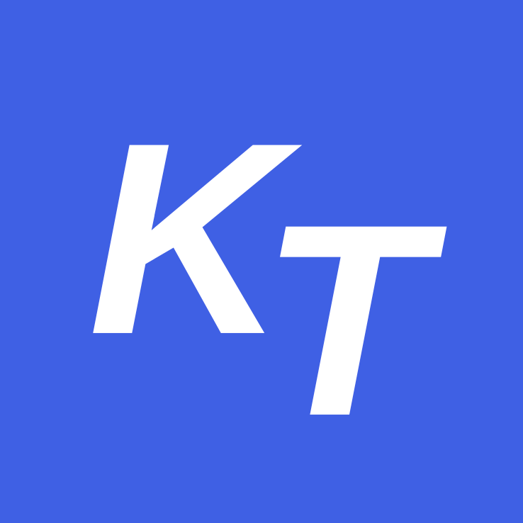

<!-- PROJECT LOGO -->
 

  

  <h2 align="center">KashTable</h2>
 
## Table of Contents
 

* [About the Project](#about-the-project)
  * [Introduction](#introduction)
  * [Built With](#built-with)
* [Author](#author)
* [License](#license)

## About the Project

### Introduction

#### Le constat

Dans le contexte économique actuel, les startup, PME et TPE sont plus exposées que jamais à des problèmes de liquidités. La maîtrise du BFR et de la rentabilité sont des facteurs clés de succès. 

#### Notre solution 

Sur la base d’un premier diagnostic réalisé par nos experts, nous pourrons vous proposer les outils de reporting financiers adaptés qui vous permettront un pilotage plus efficient de votre business.
Nos experts s’appuient sur des années d’expérience dans l’univers de l’analyse financière au cours desquelles ils ont été exposés à de nombreuses problématiques autour des enjeux que sont la rentabilité, le BFR et le cash. 
Notre solution vous garantit un reporting financier complet (compte de résultat , BFR, cash-flow) en ligne, revu et fiabilisé  par nos experts. Vous serez désormais en mesure d’avoir de la visibilité sur votre performance historique comme sur votre prévisionnel de trésorerie, afin de mieux l’anticiper. Vous ne vous souciez de rien, nous nous connectons directement à votre logiciel de comptabilité ou de facturation afin de récupérer l’intégralité de vos données financières. Votre unique mission, consulter chaque mois votre Kashtable sur notre plateforme Saas dans votre espace dédié et sécurisé.

#### More info on https://kashtable.kavalry.fr/

### Built With

#### Python 

- flask
- flask_sqlalchemy
- flask_bcrypt
- flask_login
- flask_mail
- flask_admin
- flask_basicauth
- flask_wtf
- flask_excel
- os
- pandas
- itsdangerous
- sqlalchemy_utils
- datetime
- json
- jinja2
- uuid
- wtforms
- secrets
- PIL
- dateutil

#### Other dependencies

- Bootstrap
- HighCharts
- DataTables
- KeenThemes JS bundles

## Author

**Jean Meilhoc Ricaume** - [LinkedIn](www.linkedin.com/in/j-mr)

## License

This project is licensed under the MIT License
