<!-- PROJECT LOGO -->
<br />

<p align="center">
  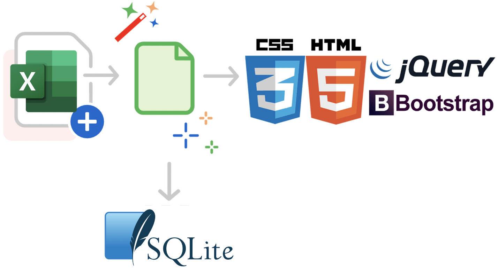
</p>

<h2 align="center">KashTable</h2>

# 💡 Table of Contents
<br>

* [About the Project](#about-the-project)
*   [Business](#business)
*   [Solution](#solution)
* [General](#general)
  * [Run locally](#run-locally)
  * [Built With](#built-with)
    * [Python](#python)
    * [Other Dependencies](#other-dependencies)
  * [Model](#model)
* [Excel Mandatory Format](#excel-mandatory-format)
  * [Column Name](#column-name)
  * [Formatter](#formatter)
* [Client Side](#client-side)
  * [Access](#access)
    * [Register](#register)
    * [Login](#login)
    * [Reset Password](#reset-password)
    * [Aside](#aside)
      * [Not Authenticated](#not-authenticated)
      * [Authenticated](#authenticated)
  * [Profile](#profile)  
  * [Upload](#upload)
  * [Posts](#posts)
    * [Home](#home)
    * [Table](#table)
  * [Graph](#graph)
* [CRUD Admin](#crud-admin)
  * [Home](#home)
  * [User](#user)
    * [List](#list)
    * [Create](#create)
    * [Details](#details)
    * [Edit](#edit)
  * [File](#file)
    * [List](#list)
    * [Create](#create)
    * [Details](#details)
* [License](#license)

# ⚡ About the Project

### 💼 Business

- Solve liquidity issues triggered by uncertain economic environment
- Maintain EBITDA as well as key performance drivers

### 👉 Solution

- Diagnostics
- Financial reporting
- Business drivers
- Financial analysis
- Visibility
- Forecast
- Integrated SAAS 
- Secure

More info on https://kashtable.kavalry.fr/

# 💎 General

## 🏀 Run locally

```
from KashTable import create_app
app = create_app()
app.run(debug=True) 
```

## 💬 Built With

### :snake: Python 

- flask
- flask_sqlalchemy
- flask_bcrypt
- flask_login
- flask_mail
- flask_admin
- flask_basicauth
- flask_wtf
- flask_excel
- os
- pandas
- itsdangerous
- sqlalchemy_utils
- datetime
- json
- jinja2
- uuid
- wtforms
- secrets
- PIL
- dateutil

### 📦 Other dependencies

- Bootstrap
- HighCharts
- DataTables
- KeenThemes JS bundles

## 🎨 Model

<p align="center">
  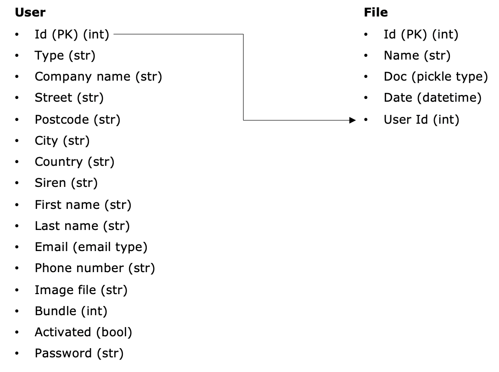
</p>

# 😇 Excel Mandatory Format

## 👀 Column Name

<p align="center">
  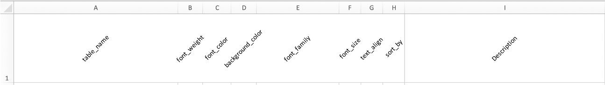
</p>

## ✔️ Formatter

<p align="center">
  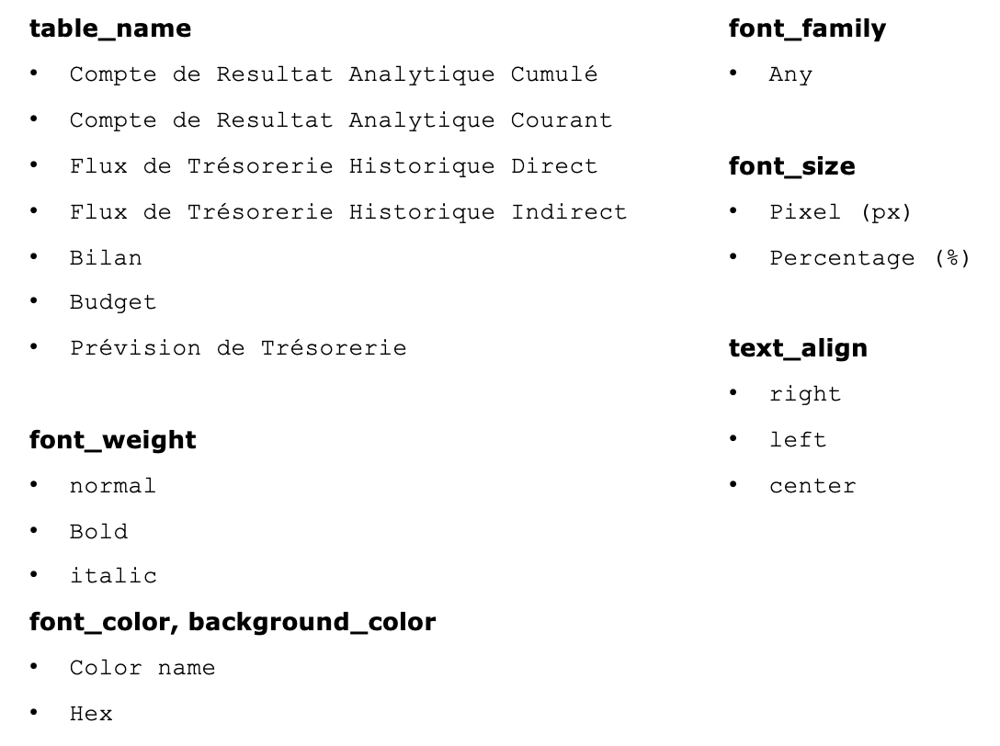
</p>

# 🐶 Client Side

## 🧬 Access

### Register

<p align="center">
  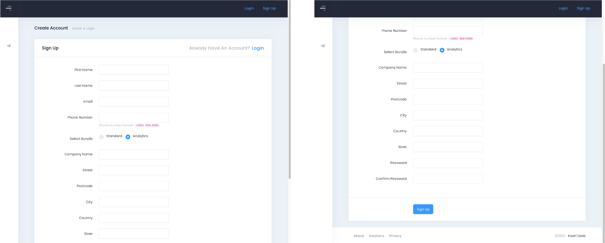
</p>

### 🏄‍♂️ Login

<p align="center">
  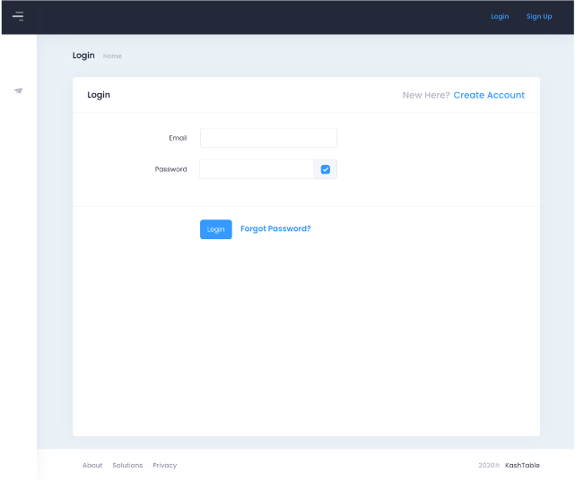
</p>

### 🔫 Reset Password

<p align="center">
  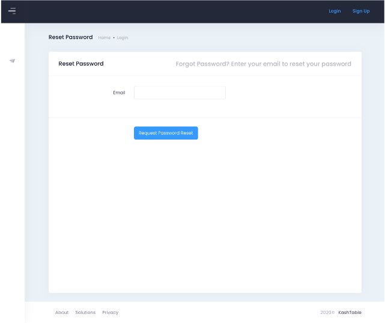
</p>

### 💣 Aside

#### 🛑 Not Authenticated

<p align="center">
  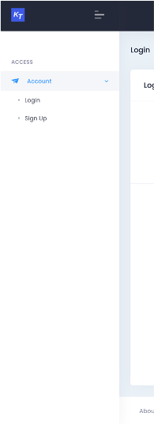
</p>

#### ✅ Authenticated

<p align="center">
  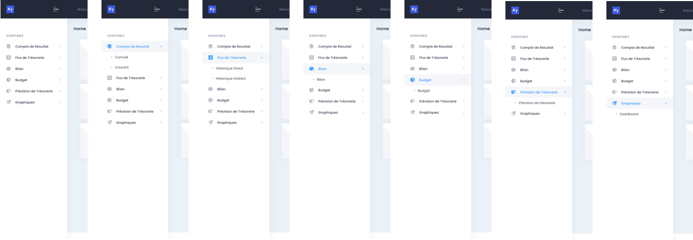
</p>

## 🥳 Profile

<p align="center">
  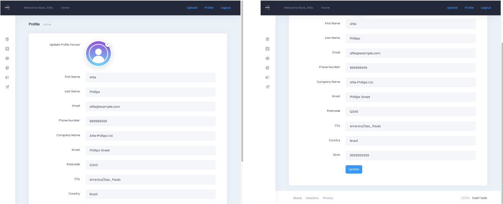
</p>

## ⬆️ Upload

<p align="center">
  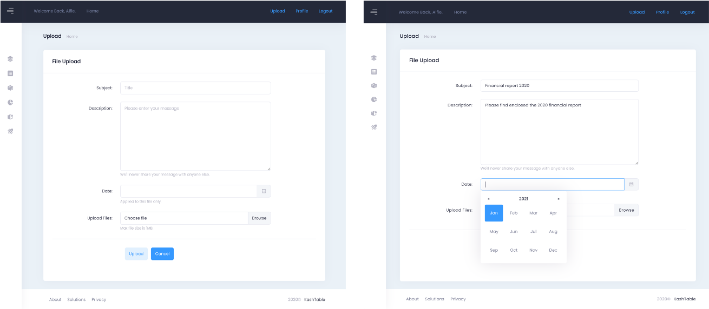
</p>

## 🔥 Posts

### 🏠 Home

<p align="center">
  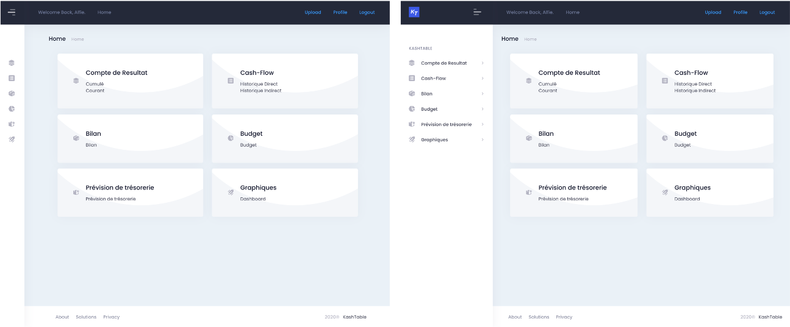
</p>

### ⛳ Table

<p align="center">
  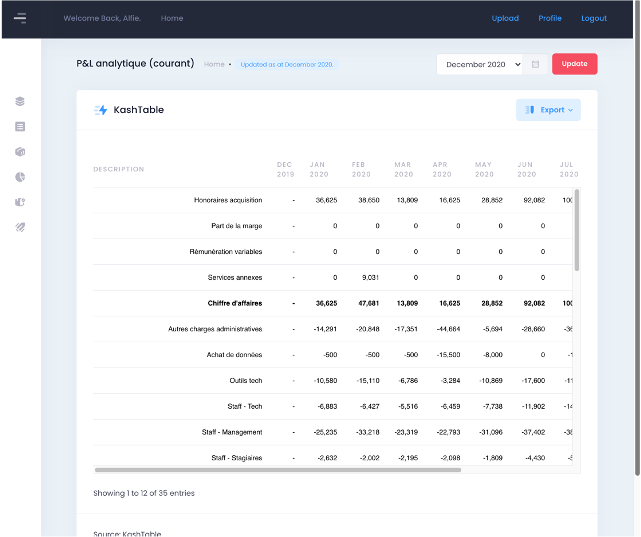
</p>

## 🎰 Graph

<p align="center">
  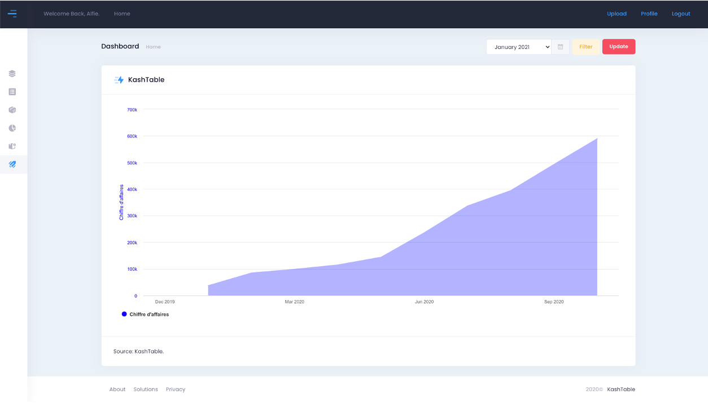
</p>

# 🏛️ CRUD Admin

## 🏠 Home

<p align="center">
  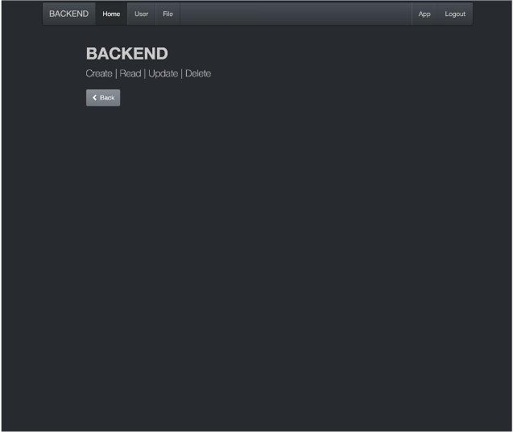
</p>

## 😀 User

### 💯 List

<p align="center">
  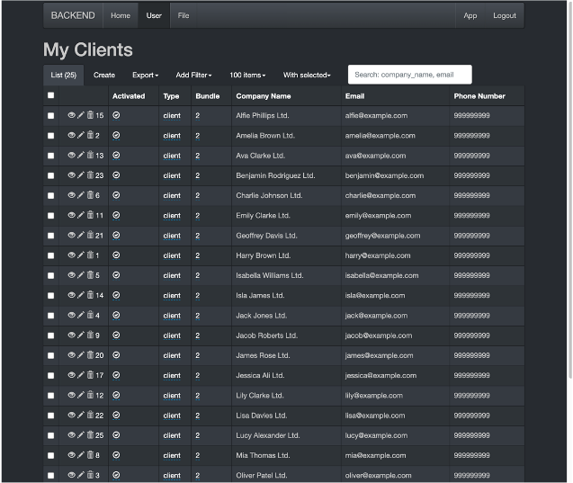
</p>

### ♣️ Create

<p align="center">
  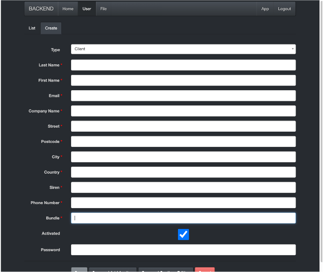
</p>

### ➡️ Details

<p align="center">
  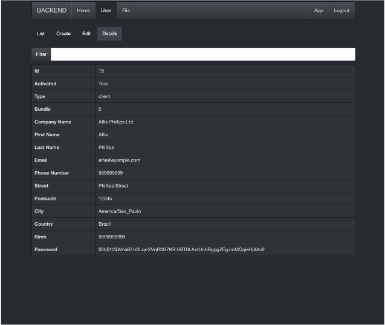
</p>

### 🕹️ Edit

<p align="center">
  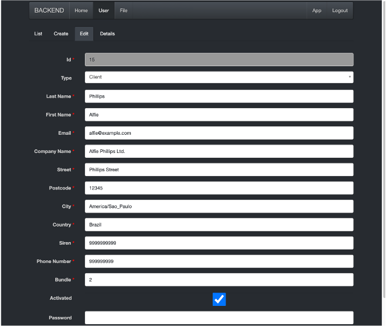
</p>

## 🧳 File

### 🎙️ List

<p align="center">
  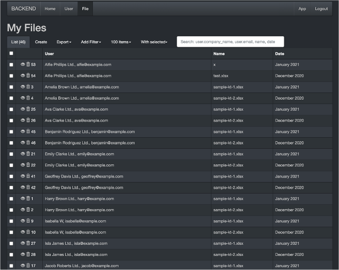
</p>

### 🧱 Create

<p align="center">
  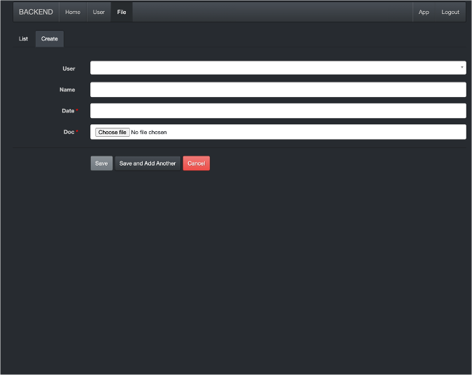
</p>

### 😎 Details

<p align="center">
  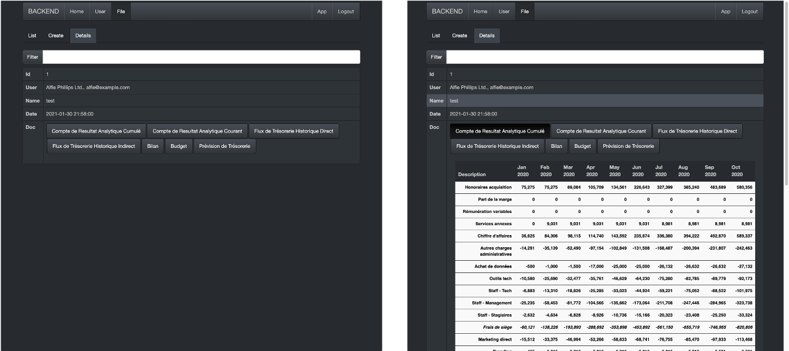
</p>

# 📖 License

This project is licensed under the MIT License
